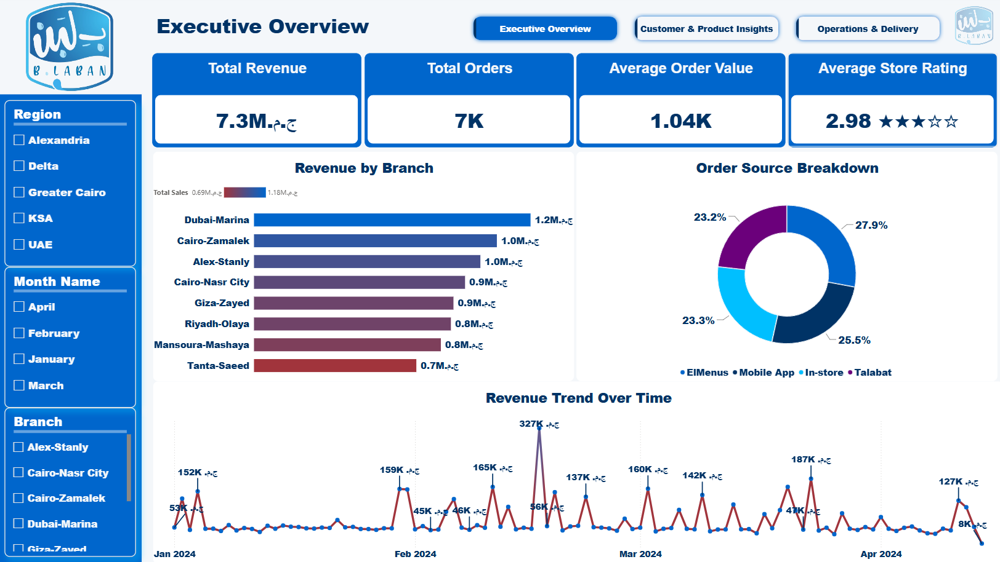
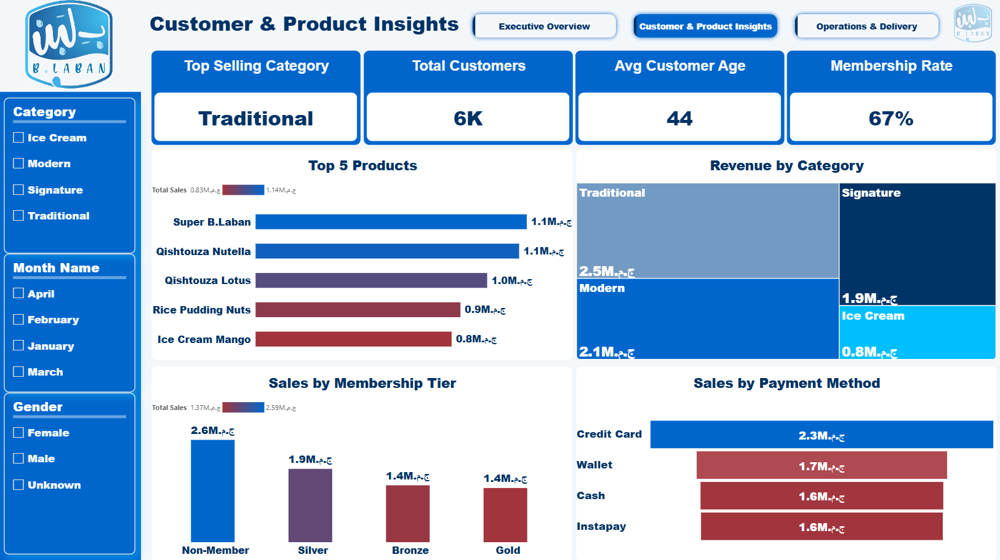
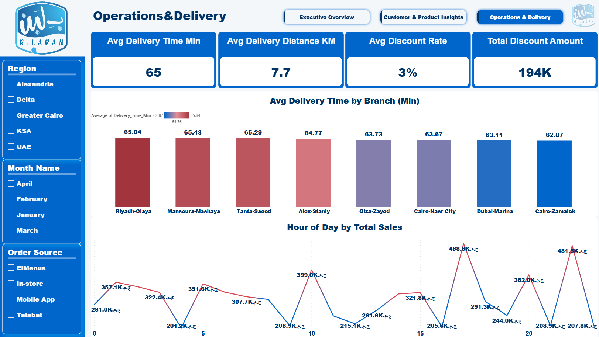

# B.Laban Sales & Operations Dashboard

**An end-to-end data analytics project** — from raw transactional data to a polished, interactive Power BI dashboard — covering data cleaning in Python, data modeling in Power BI, DAX measure design, and honest documentation of data limitations.

---

## 📌 Project Overview

B.Laban is a fictional dessert & dairy retail chain operating across branches in Egypt, KSA, and the UAE. This project analyzes **7,000 transactions** across **28 fields** to answer three core business questions:

1. How is revenue performing across branches, regions, and time?
2. Who are our customers, and what do they buy?
3. How efficient is our delivery and discount operation?

The result is a 3-page interactive Power BI report with custom navigation, dynamic measures, and a properly modeled date dimension.

---

## 🧹 Step 1: Data Cleaning (Python / pandas)

The raw dataset (`blaban_train.csv`) had real-world messiness that needed deliberate decisions, not just blind `fillna()` calls.

```python
import pandas as pd
import numpy as np

df = pd.read_csv('blaban_train.csv')

# Initial audit before touching anything
print(f"Shape: {df.shape}")
print(df.isnull().sum()[df.isnull().sum() > 0])
```

**Missing values found:**

| Column | Missing | % of rows |
|---|---|---|
| Topping_Type | 1,997 | 28.5% |
| Membership_Status | 2,336 | 33.4% |
| Customer_Gender | 858 | 12.3% |
| Store_Rating | 832 | 11.9% |
| Customer_Age | 820 | 11.7% |

**Cleaning decisions:**

- **Topping_Type** → filled with `"None/Plain"` (a missing topping most likely means no topping was added, not a data entry error).
- **Customer_Gender** → filled with `"Unknown"` rather than guessing.
- **Customer_Age** → filled with the **median**, not the mean, to avoid distortion from outlier ages.
- **Store_Rating** → filled with the mean rating (11.9% missing, low enough that this doesn't meaningfully flatten the distribution).
- **Total_Sales** → **recalculated from scratch** rather than trusted as-is, to guarantee consistency with `Quantity`, `Unit_Price`, `Discount_Rate`, and `Tax_Amount`:

```python
df_clean['Total_Sales'] = round(
    (df_clean['Quantity'] * df_clean['Unit_Price'] * (1 - df_clean['Discount_Rate']))
    + df_clean['Tax_Amount'], 2
)
```

### ⚠️ A limitation worth being upfront about: Membership_Status

`Membership_Status` was initially filled with `"Non-Member"` for all missing values, under the assumption that a blank status meant the customer wasn't enrolled. Digging deeper into the data revealed this assumption doesn't fully hold:

- **585 customers** appear in more than one transaction.
- Of those, **418 customers have inconsistent Membership_Status values across their own rows** — e.g. the same `Customer_ID` shows up once as `NaN` and once as `"Silver"` or `"Gold"` in a different order.

Since membership tier should logically be a stable customer attribute (not something that changes order-to-order), this strongly suggests the missing values are **incomplete records**, not genuine non-members. The `Membership Rate` metric in the dashboard (67%) should therefore be read as **a reasonable estimate under an imperfect assumption**, not a precise figure — a limitation this project deliberately documents rather than hides.

A more robust fix (not applied to the current dashboard version, kept here as a lesson learned) would be:

```python
# Fill missing status using any other known status for the same customer first
df_clean['Membership_Status'] = df_clean.groupby('Customer_ID')['Membership_Status'] \
    .transform(lambda x: x.ffill().bfill())

# Only assume "Non-Member" for customers with a single order and no other reference
df_clean['Membership_Status'] = df_clean['Membership_Status'].fillna('Non-Member')
```

---

## 🏗️ Step 2: Building the Data Model in Power BI

The cleaned CSV was loaded into Power BI as a single flat table. Two modeling issues surfaced during development — both are worth documenting because they're common traps in real dashboards.

### Issue #1: Wrong aggregation on a delivery metric

The **Avg Delivery Time by Branch** chart initially used `Count` instead of `Average` on `Delivery_Time_Min`. This silently turned "which branch is slowest" into "which branch has the most orders" — a completely different (and misleading) insight. Fixed by switching the aggregation to `Average` and sorting descending, which immediately surfaced a real, actionable finding: **Riyadh-Olaya and Mansoura-Mashaya have the slowest average delivery times (~65–66 min)**, while **Cairo-Zamalek is the fastest (~63 min)**.

### Issue #2: The "Revenue Trend Over Time" chart was silently wrong

This was the most important fix in the project. The source data had already been split into separate `Month` and `Day` columns during the Python cleaning stage. Using `Day` alone as the X-axis meant the chart was **aggregating every "day 17" across all four months into a single point** — January 17th, February 17th, March 17th, and April 17th were all being summed together as one number.

**How it was diagnosed:** the axis only showed 31 points total (not the ~105 expected across 4 months), and hovering a data point showed a tooltip labeled `"Earliest Full_Date"` — a strong signal Power BI was resolving one label from multiple underlying dates.

**The fix:** a calculated column was added to reconstruct a real date from the separated Month/Day fields:

```dax
Full_Date =
VAR MonthNum =
    SWITCH(
        blaban_cleaned_final[Month Name],
        "January", 1, "February", 2, "March", 3, "April", 4,
        "May", 5, "June", 6, "July", 7, "August", 8,
        "September", 9, "October", 10, "November", 11, "December", 12
    )
RETURN
    DATE(2024, MonthNum, blaban_cleaned_final[Day])
```

`Full_Date` was then used (with Power BI's Auto Date/Time hierarchy resolved down to the plain field, and the axis set to **Continuous**) as the X-axis. The trend line now correctly shows revenue moving through **January → February → March → April 2024**, instead of a meaningless 31-point blend.

**Lesson:** splitting a date into parts during cleaning is fine for categorical breakdowns (e.g. "average sales by day-of-week"), but a **continuous time-series chart needs a real, reconstructed date field** — never raw date parts.

---

## 📊 Step 3: DAX Measures

A small library of measures powers the KPI cards across the report. One example, chosen for its use of `REPT()` to build a visual star rating without a custom visual:

```dax
Rating Stars =
VAR AvgRating = AVERAGE(blaban_cleaned_final[Store_Rating])
VAR RoundedRating = ROUND(AvgRating, 0)
VAR FilledStars = REPT("★", RoundedRating)
VAR EmptyStars = REPT("☆", 5 - RoundedRating)
RETURN
    FORMAT(AvgRating, "0.00") & " " & FilledStars & EmptyStars
```

Other measures include `Average Order Value`, `Avg Delivery Distance`, `Avg Discount Rate`, `Total Discount Amount`, and `Membership Rate`, each built with `VAR` for readability rather than nested one-liners.

---

## 📈 Step 4: The Dashboard — 3 Pages

Custom icon-based navigation buttons (built with Power BI's blank button + Page Navigation action) link all three pages together, with the active page visually highlighted.

### 1. Executive Overview
High-level KPIs (Total Revenue: 7.3M, Total Orders: 7K, AOV: 1.04K, Avg Rating: 2.98★), revenue by branch, order source breakdown, and the corrected revenue trend line.

**Key insight:** Dubai-Marina is the top-revenue branch (1.2M), and ElMenus is the leading order source (27.9%) — closely followed by in-store orders (25.5%).

### 2. Customer & Product Insights
Top-selling products, revenue by category (Traditional, Modern, Signature, Ice Cream), membership tier breakdown, and payment method distribution.

**Key insight:** *Super B.Laban* and *Qishtouza Nutella* are statistically tied as the top two products (~1.1M each), and Credit Card is the dominant payment method (2.3M) — nearly 35% ahead of the next closest method.

### 3. Operations & Delivery
Average delivery time by branch (color-graded, slowest to fastest), and total sales by hour of day.

**Key insight:** Sales peak sharply around midday and again in the evening — a pattern that could directly inform staffing schedules.

---

## 🖼️ Dashboard Screenshots

### Executive Overview
High-level KPIs, revenue by branch, order source split, and the (fixed) monthly revenue trend.



### Customer & Product Insights
Top products, revenue by category, membership tiers, and payment method breakdown.



### Operations & Delivery
Delivery time by branch and hourly sales pattern.



---

## 🧠 What This Project Demonstrates

- Making — and documenting — **defensible assumptions** during data cleaning, rather than silently guessing.
- Catching a **misleading visual** (Count vs. Average) before it reached a stakeholder.
- Diagnosing a **subtle data modeling bug** (date fragmentation) using tooltip evidence, not just "it looks wrong."
- Being transparent about a **known limitation** (Membership_Status ambiguity) instead of presenting every KPI as equally certain.

---

## 🛠️ Tech Stack

- **Python** (pandas, numpy) — data cleaning & validation
- **Power BI Desktop** — data modeling, DAX, report design
- **DAX** — calculated columns & measures

---

## 📂 Files

```
├── blaban_cleaned_final.csv      # Cleaned, analysis-ready dataset
├── b.labn Dashboard.pbix         # Power BI report
└── images/                       # Dashboard screenshots
```

> Note: the raw source CSV and the Python cleaning notebook are not included in this repo. The full cleaning logic is documented step-by-step in the **Data Cleaning** section above.
